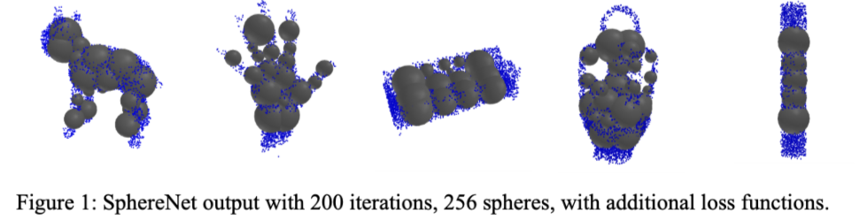
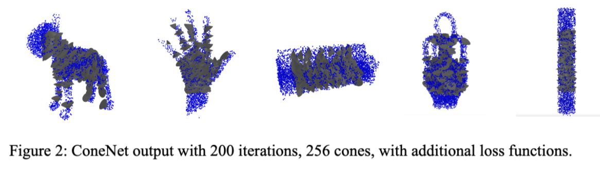
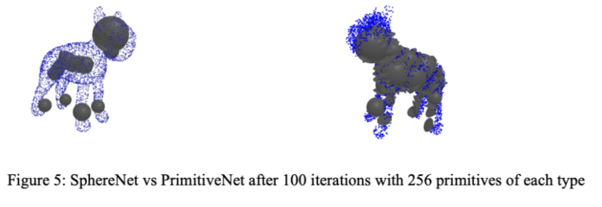
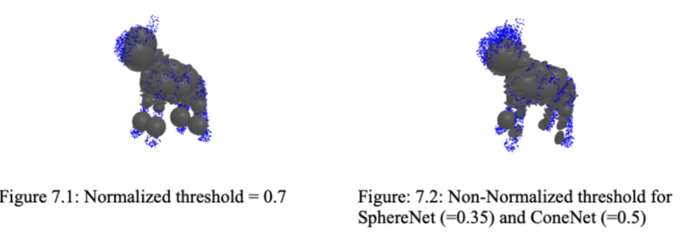

# 3D-Shape-Parametric-Representation
Primitive Fitting to Voxel Data with Neural Nets

Group project by Kathy Lee, John Mitton, Ellie Neufeld

The goal of the project is to see how best we can fit primitives to 3d voxel data using a neural net over traditional techniques. The primtives chosen were spheres, cones, and cylinders. The implementaiton was based off of code frome a previous assignment in the class which had a working SphereNet for spehre fitting to point cloud data.  This code was then taken and altered to take in voxel data as input, utilize more primitive types for fitting, and improved with different loss functions.  Loss functions implemented were inside coverage loss, graded outside loss, and large spehre loss.

Sphere and cone fitting performed the best, however, the group was unable to get cylinder fitting to work. As a result, the output only uses the fitting of spehres and cones. 

Once each primitive type is fitted to the voxel data, the mean squared error is calculated between the primitive SDF values and the ground truth SDF values.  Looking at the min and max error of each primitive type, primitives are selected to keep or discard based on error thresholds. 

My tasks: 
- Related work research 
- Voxel input adaptation of SphereNet
- ConeNet implementation 
- Report

All images taken from group report

