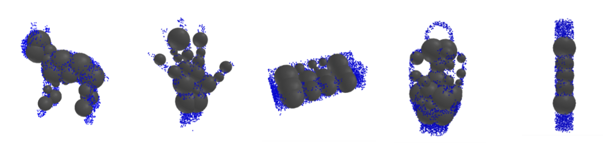

# 3D-Shape-Parametric-Representation

Primitive Fitting to Voxel Data with Neural Nets
Group project by Kathy Lee, John Mitton, Ellie Neufeld

The goal of the project is to see how best we can fit primitives to 3d voxel data using a neural net over traditional techniques. The primtives
chosen were spheres, cones, and cylinders. The implementaiton was based off of code frome a previous assignment in the class which had a working SphereNet for spehre fitting to 3D geometry.  This code was then taken, and altered to take in voxel data as input and then improved upon with different loss functions.  Loss functions implemented were inside coverage loss, graded outside loss, and large spehre loss. 

